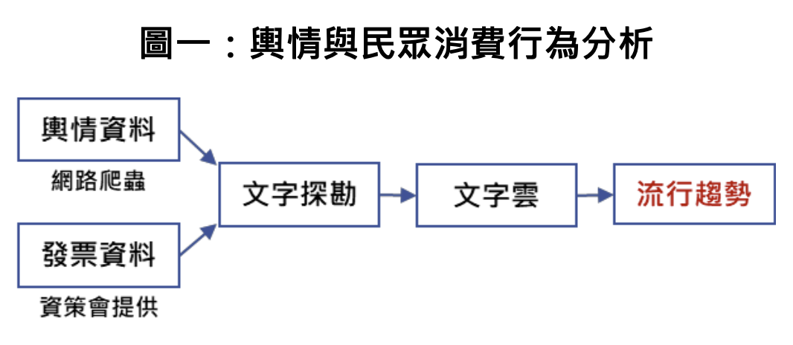
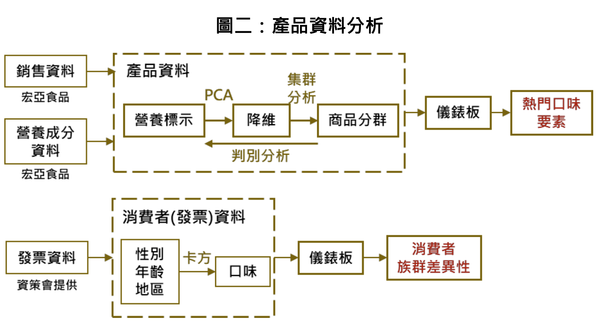

# 熱門巧克力和餅乾口味變化預測-宏亞食品
- 2021年企業數據競賽
- 報告日期：2021/11/26

## 簡介
 由於消費者對於巧克力及餅乾等零食口味的喜好變化迅速，宏亞食品提 出了這道題目，希望能找出近年巧克力與餅乾最流行的必備因素，預測消費者 喜愛口味以利研發布局。     
 為解決此問題，我們針對輿情及民眾消費資料做文字探勘，觀察討論度高 的人氣口味;又結合宏亞食品提供的銷售資料與營養成分資料，做主成分分析 與群集分析，找出銷量高的產品特徵，發現了可以針對不同群的旺季，推出不 同的新口味;最後以卡方檢定證實了性別、年齡、地區都與口味偏好有關聯，可以鎖定客群推出產品。

   
 

## 檔案說明
- `簡介_熱門巧克力和餅乾口味變化預測.pdf`: 內容概要
- `2021企業數據競賽_我們與巧克力的距離.pdf`: 報告PPT
- `bill_freq.R`: 視覺化發票資料中頻率與口味的關係。
- `clean.R`: 產品成分資料的預處理
- `text_mining.R`: 輿情、發票資料預處理
- `text_mininggggg.py`: 文字探勘
- `cluster.pbix`: Power BI 檔案，用於數據分群分析。
- `momo sales.pbix`: Power BI 檔案，展示 Momo 銷售數據。
- `pchome sales.pbix`: Power BI 檔案，展示 PChome 銷售數據。

 ## Note
- 資料由 **宏亞食品**與**OpView 社群口碑資料庫**提供。
- 以上僅包含前處理有關之程式碼。若閱讀或使用過程中遇到任何問題，或者有任何改進的建議，歡迎通過以下的電子郵件與我聯繫：[tiffany217.h@gmail.com](mailto:tiffany217.h@gmail.com)。

